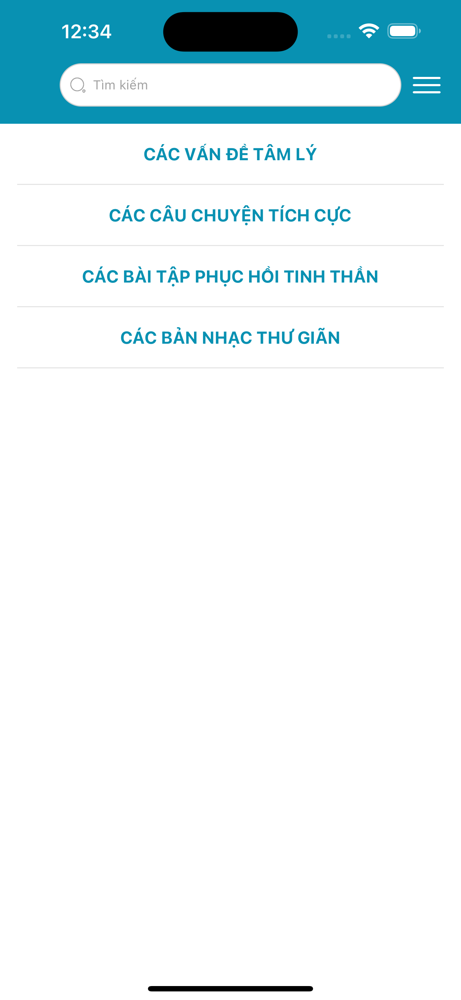

# Joyful Mind App

## Demo App

https://drive.google.com/file/d/16B-Gs7Hu8jc--S4Cy31DQhJKMgPeQLRB/view?usp=drive_link

## Table of Contents

- [Joyful Mind App](#joyful-mind-app)
  - [Demo App](#demo-app)
  - [Table of Contents](#table-of-contents)
  - [About](#about)
  - [Features](#features)
  - [Screenshots](#screenshots)
  - [Getting Started](#getting-started)
    - [Prerequisites](#prerequisites)
    - [Installation](#installation)

## About
- The school-age period is full of psychological fluctuations due to physical and mental changes. Students have to face pressures from studying to career orientation. Therefore, it is not surprising that many students experience stress, anxiety, and lack of confidence.
- Joyful Mind App is created to solve the above problem. This App will help you improve your mental health and restore your psychology. Joyful Mind App provides various features:
  - Articles on mental health: updates the latest information on common psychological issues such as stress, depression, anxiety.
  - Inspirational stories: Read interesting stories about courage, hope, inner strength to get inspired.
  - Emotion diary: Record your emotions daily to track your moods and find solutions.
  - Relaxation and stress relief exercises: Guides you through effective meditation, yoga, muscle relaxation techniques.

## Features

-   Psycho Problem
-   Self-help Story
-   Relaxing Music
-   Exercises

## Screenshots

<p float='left'>




</p>

## Getting Started

### Prerequisites

-   Node.Js: https://nodejs.org/en
-   Expo: https://docs.expo.dev/get-started/installation/
-   Yarn: https://classic.yarnpkg.com/lang/en/docs/install/#mac-stable

### Installation

-   Clone the repository to your local machine
-   Install dependencies using npm or yarn
-   Run the app using `yarn start` or another suitable command

```bash
git clone https://github.com/cuong0912pham/JoyfulMind.git
cd JoyfulMind
yarn
yarn start
```